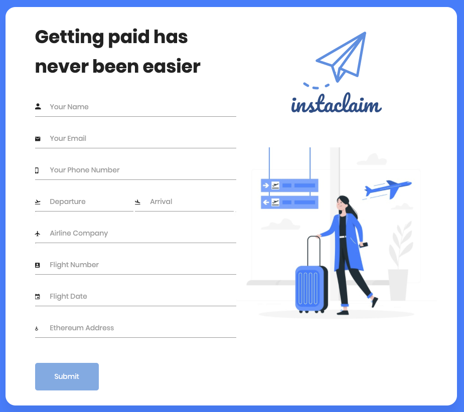
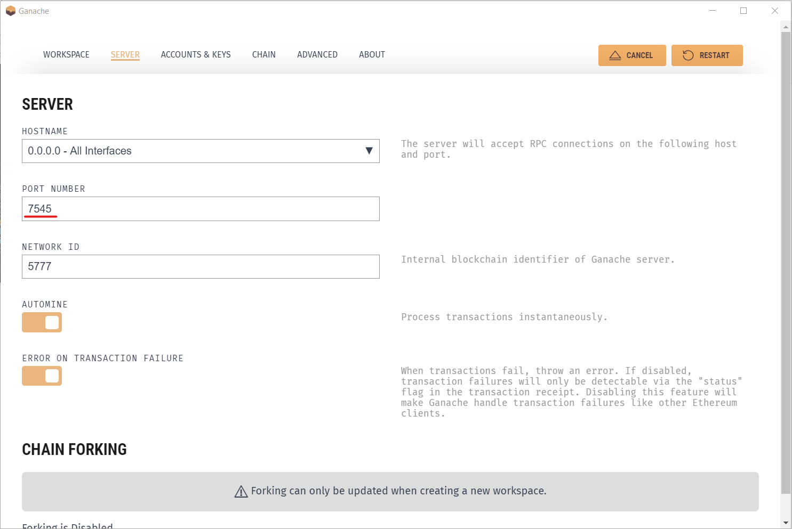
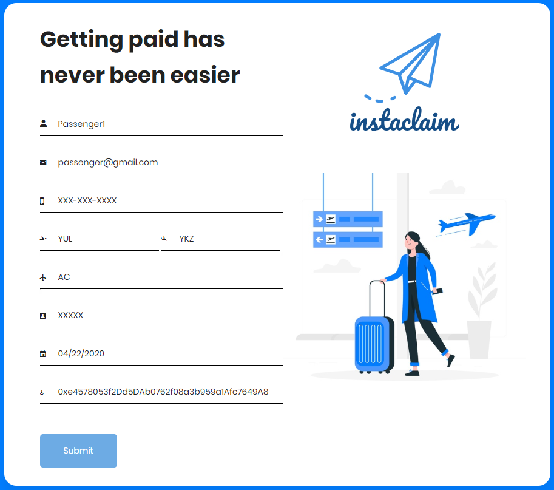
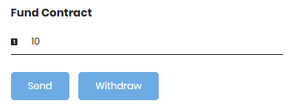
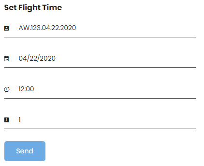
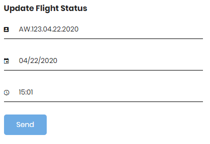
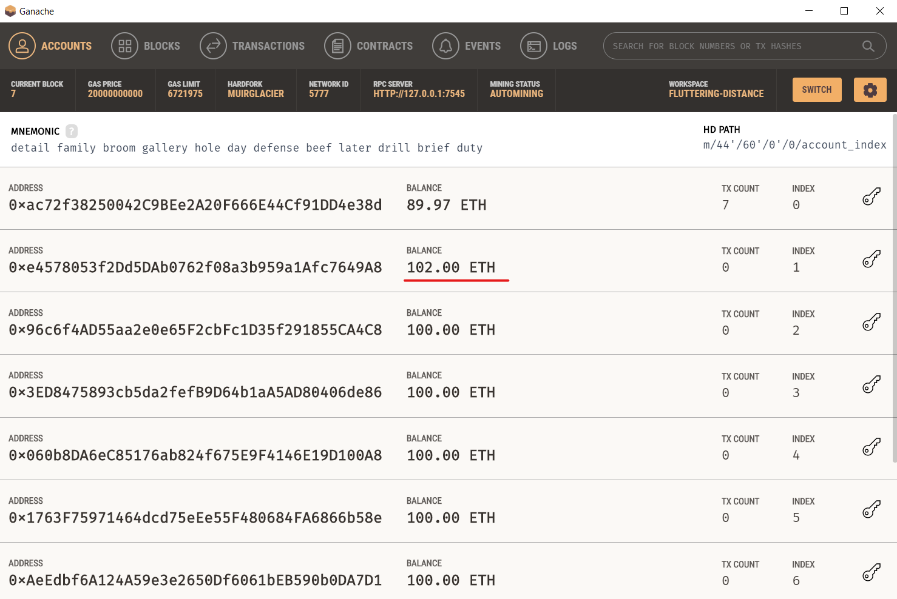
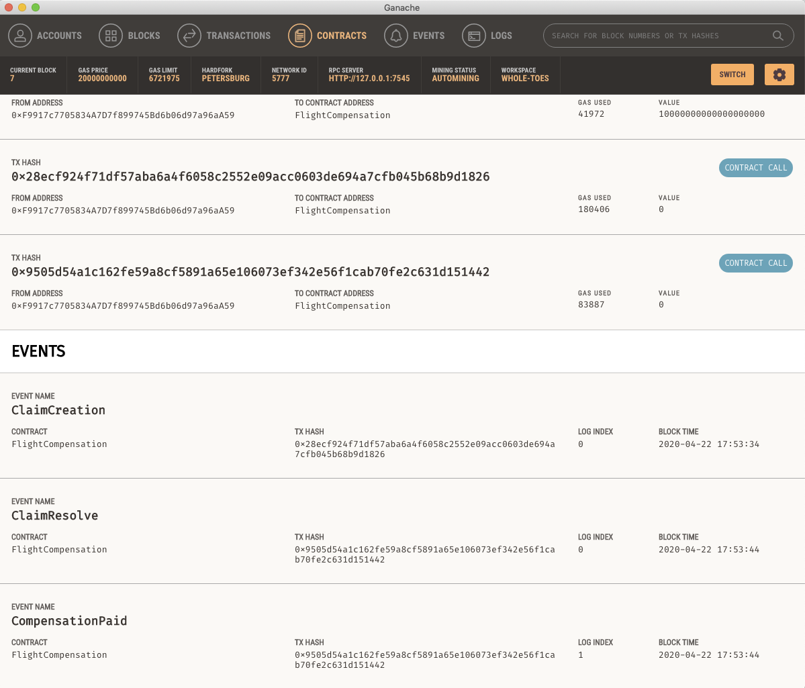

# Instaclaim - Getting paid has never been easier
Automatic flight interruption (delays, cancellations) claims and payment processing using smart contracts in the Blockchain

## In order to launch Instaclaim you will need to install the following:

1. Make sure Node.js is installed: [Install Node.js](https://nodejs.org/en/)

2. Make sure npm is installed: [Install npm](https://www.npmjs.com/get-npm)

3. Using npm install truffle:
`npm install -g truffle`

4. Verify if truffle was correctly installed using: `truffle version`

5. [Install Ganache](https://www.trufflesuite.com/ganache) (We recommend the GUI version in order to more easily view the changes in the account balances and the events emitted).

6. Install the Metamask extension in your browser. [We recommend the chrome version](https://chrome.google.com/webstore/detail/metamask/nkbihfbeogaeaoehlefnkodbefgpgknn?hl=en).

## To launch Instaclaim complete the following steps:

1. Clone the project: `git clone https://github.com/afuadhossain/IFT6056-Project.git`

2. Go to the main directory: `cd IFT6056-Project`

3. Launch the Ganache application and create a new workspace (or run ganache-cli).

4. In the Ganache GUI, click on add project and add the truffle-config.js present in the main directory. (If not prompt with the window to add project, click on the setting button.) See the image below.

5. In Ganache, go to Settings -> Server. Make sure the port number is 7545. (This can be configured to another port in truffle-config.js)

6. Deploy the contract: `truffle migrate --reset`

7. Launch Instaclaim using: `npm run dev`

8. You should get a notification in MetaMask requesting for permissions. Click on connect.

9. In MetaMask go to Settings -> Networks -> Add Network: In the field Network Name enter "Instaclaim" and in New RPC URL enter "http://127.0.0.1:7545". Click on save and select the new network.

10. In MetaMask go in import account and important a private key of one of the addresses in Ganache. This will serve as the contract creator. (If the account balance does not update go to Settings -> Advanced -> Reset Account)

11. Fill in the passenger's information and create a flight. In the field Ethereum Address, enter the address of one of the accounts in Ganache. The application will return you an error if any field is missing or the information is wrong.

12. After creating the flight, you will need to fund the contract with some ether (using the account you entered in MetaMask from Ganache). You can use 10 ethers.

13. You can now set the flight status; enter the scheduled arrival time (the time the plane is supposed to be landing) and the airline type. The airline type is 0 for small airline and 1 for large airline.

13. After setting the flight status, you can now update the actual arrival time of the plane (This would be done by an oracle in a real situation). If the flight is delayed by 3-6-9 hours, or more, you should see the balance of the associated compensation address updated in Ganache by the value of the compensation in Ether. 

14. In this case, the second address received 2 ethers for a delay of 3hours using a large airline. An email will also be sent to your email address with the information. Unfortunetaly, it costs money to send text messages so we disabled this feature. All the events including the transactions are recorded in the receipts on the blockchain. These can be viewed in Ganache in the Contracts and Events tabs.

